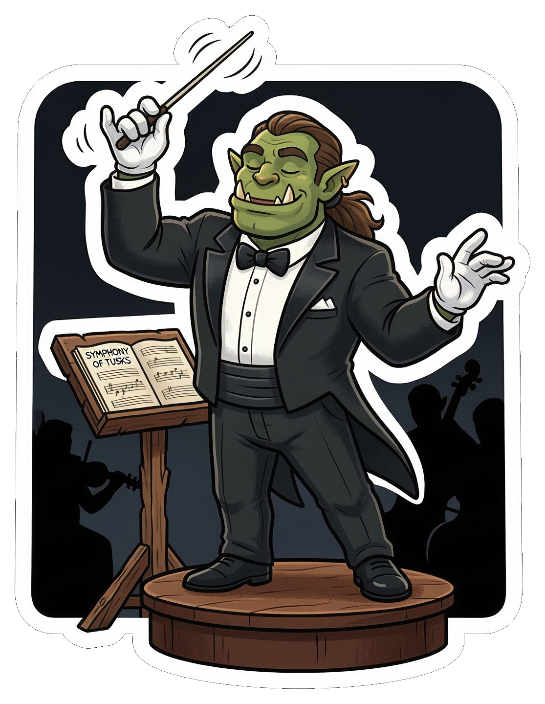

# orc

<p align="center">
  
</p>

**orc** is a standalone multi-agent orchestrator that runs a planner → coder → qa loop against any git repository, coordinating agents over Telegram.

## How it works

```
orc run
  └── planner                   – reads vision docs, creates tasks in orc/work/
        └── coder               – implements each task on a feature branch
              └── qa            – reviews the branch, commits qa(passed): or qa(failed):
                    └── orc     – merges the feature branch into dev, loops back to planner
```

Inter-agent synchronization happens over git and interaction with the user is mediated by a telegram bot. 
The orchestrator inspects the git tree status to determine the current state and decide which agent(s) to run next depending on the pool of available agents.

## Installation

```bash
pip install qorc
# or with uv:
uv add qorc
```

## Quick start

```bash
# 1. Install
pip install qorc

# 2. Scaffold the orc/ config directory in your project
cd your-project/
orc bootstrap

# 3. Edit orc/roles/*.md to customise agent instructions (optional)
# 4. Add vision documents to orc/vision/
# 5. Copy .env.example → .env and fill in credentials
# 6. Add to your root justfile (optional):
#       mod orc 'orc/justfile'
# 7. Run
orc run           # or: just orc run
```

## bootstrap

`orc bootstrap` scaffolds the entire `orc/` directory structure in one command:

```
your-project/
  orc/
    roles/
      planner.md    ← bundled generic template (edit for your project)
      coder.md
      qa.md
    squads/
      default.yaml  ← 1 planner, 1 coder, 1 QA
    vision/
      README.md     ← placeholder; add your vision docs here
    work/
      board.yaml    ← empty kanban board
    justfile        ← run / status / merge recipes
  .env.example      ← credential template; copy to .env and fill in
```

Options:

```bash
orc bootstrap                   # scaffolds into ./orc/
orc bootstrap --orc-dir agents  # use a different directory name
orc bootstrap --force           # overwrite existing files
```

Existing files are **never overwritten** unless `--force` is passed.

After bootstrapping, the only things left to do are:

1. Customise `orc/roles/*.md` for your project's conventions.
2. Drop vision documents into `orc/vision/`.
3. Fill in `.env`.

## Project setup (manual)

```
your-project/
  orc/
    vision/       ← put vision documents here
    work/
      board.yaml  ← kanban board (copy from .env.example)
    squads/       ← optional: custom squad profiles
    roles/        ← optional: custom role overrides
  .env            ← copy from .env.example and fill in
```

### board.yaml

```yaml
counter: 1
open: []
done: []
```

### .env

Copy `.env.example` to `.env` and fill in:

```bash
COLONY_AI_CLI=copilot          # or "claude"
COLONY_TELEGRAM_TOKEN=...
COLONY_TELEGRAM_CHAT_ID=...
GH_TOKEN=...                   # for copilot backend
```

## Running

```bash
# Run one agent loop (default)
orc run

# Run until complete
orc run --maxloops 0

# Use a custom squad profile
orc run --squad broad

# Print current workflow state
orc status

# Rebase dev on main and merge
orc merge
```

## Squad profiles

Squad profiles live in `orc/squads/{name}.yaml` (project-level) or are provided by the package (built-in `default`). They define how many agents of each role may run in parallel:

```yaml
# orc/squads/broad.yaml
planner: 1
coder: 4
qa: 2
timeout_minutes: 180
```

The `planner` count must always be `1`. Scale throughput by adding coders and QA reviewers.

Built-in profiles:
- `default` – 1 planner, 1 coder, 1 QA (sequential)

## Agent communication (Telegram)

All agents communicate through a Telegram bot. Set up a bot via `@BotFather`, add it to a group or channel, and fill in `COLONY_TELEGRAM_TOKEN` and `COLONY_TELEGRAM_CHAT_ID`.

Agents post structured messages:
```
[coder-1](done) 2026-03-01T12:45:00Z: Implemented task 0002.
[qa-1](passed) 2026-03-01T13:00:00Z: No issues found.
```

The orchestrator reads these messages to determine the next state.

## Environment variables

| Variable | Required | Description |
|---|---|---|
| `COLONY_AI_CLI` | Yes | AI backend: `copilot` or `claude` |
| `COLONY_TELEGRAM_TOKEN` | Yes | Telegram bot token from `@BotFather` |
| `COLONY_TELEGRAM_CHAT_ID` | Yes | Target chat/group/channel ID |
| `GH_TOKEN` | copilot | GitHub token for Copilot CLI |
| `ANTHROPIC_API_KEY` | claude | Anthropic API key |
| `ORC_DIR` | No | Override config directory (default: `$CWD/orc`) |
| `ORC_LOG_LEVEL` | No | Log level (default: `INFO`) |
| `ORC_LOG_FORMAT` | No | `console` or `json` (default: `console`) |
| `ORC_LOG_FILE` | No | Log file path (default: `~/.cache/orc/orc.log`) |
